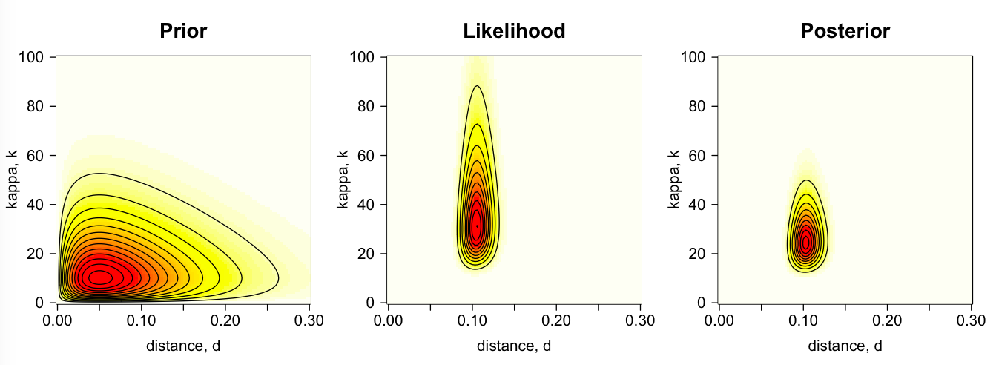
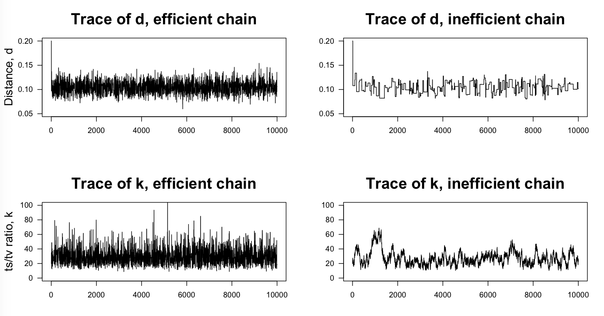

# Bayesian MCMC phylogenetics tutorial in R
Fabricia F. Nascimento, Mario dos Reis and Ziheng Yang

This repository containts two tutorials that guide the user through writing simple MCMC phylogenetics software to estimate the molecular distance (and the transition/trasversion ratio) for a pairwise sequence alignment under the Jukes and Cantor (1969) (and Kimura's 1980) substitution model. The tutorials introduce concepts such as burn-in, mixing, convergence, efficiency and autocorrelation of the MCMC chain.

Directory `JC69/` contains the MCMC tutorial to calculate the molecular distance under the JC69 model. The directory contains three files. File `mcmc.JCd.R` contains the main R code with exercises. File `mcmc.JCrt.R` contains the solution to exercise 7 in the previous file. File `BayesianMCMC-JC.pdf` contains a more detailed explanation of the theory used in the tutorial.

Directory `K80/` contains the MCMC tutorial to calculate the molecular distance and the ts/tv ratio under the K80 model. The tutorial is similar to the JC69 one, but focusing on a two parameter MCMC instead. File `mcmc.K80.R` contains the main R code. A detailed step-by-step explanation of the R code is given at:

https://thednainus.wordpress.com/2017/03/03/tutorial-bayesian-mcmc-phylogenetics-using-r/

In the K80 tutorial the user will be able to reproduce the plots to appear in our forthcoming review: A biologist's guide to Bayesian phylogenetic analysis, by Nascimento, dos Reis and Yang (2017, Nature Ecology and Evolution, available from the end of September 2017). For example, the plot below shows the prior, likelihood and posterior surfaces for the distance, d, and the ts/tv ratio, k, for the K80 example:

And these are the traces for d and k obtained from an MCMC algorithm written to sample from the posterior surface above:

We hope you enjoy the tutorials. If you have any questions or comments please let us know.

Fabricia, Mario and Ziheng.
